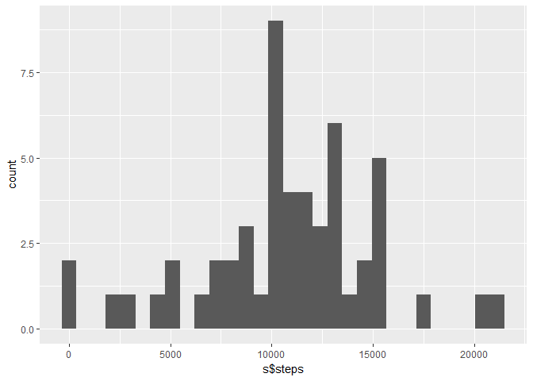
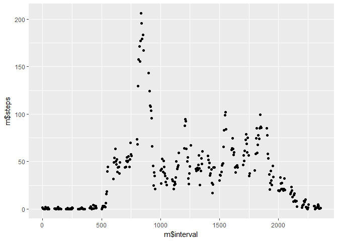
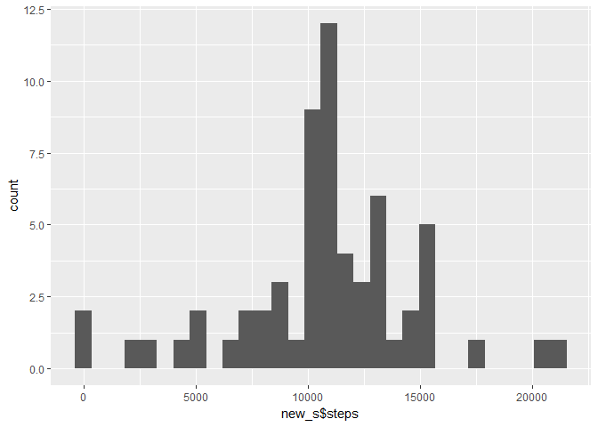
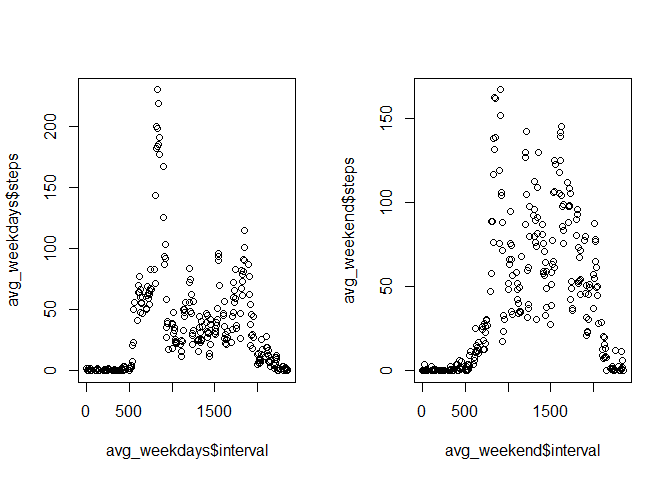

    knitr::opts_chunk$set(echo = TRUE)
    library(lubridate)

    ## 
    ## Attaching package: 'lubridate'

    ## The following object is masked from 'package:base':
    ## 
    ##     date

    library(ggplot2)
    dat <- read.csv("activity.csv",header=TRUE)

What is the mean total number of steps taken per day?
-----------------------------------------------------

    s <- with(dat,aggregate(steps~date,FUN=sum))
    qplot(s$steps,geom="histogram")

    ## `stat_bin()` using `bins = 30`. Pick better value with `binwidth`.

This is a histogram of the total number of steps taken per day. The mean
number of steps taken is 10766, and the median number of steps taken is
10765.

What is the average daily activity pattern?
-------------------------------------------

    m <- with(dat,aggregate(steps~interval,FUN=mean))
    qplot(m$interval,m$steps)

This is a time series of the average number of steps taken during each
time interval. The interval with the maximum steps taken on average is
interval 835.

Imputing missing values
-----------------------

    nas <- sum(is.na(dat$steps))

There are 2304 missing values. To fill in the missing values, we can
replace them with the average number of steps taken in each interval.

    nas_filled <- dat
    for(i in 1:length(nas_filled$steps)){
      if(is.na(nas_filled$steps[i])){
        interval <- nas_filled$interval[i]
        avg_steps <- m$steps[which(m$interval==interval)]
        nas_filled$steps[i] <- avg_steps
      }
    }
    new_s <- with(nas_filled,aggregate(steps~date,FUN=sum))
    qplot(new_s$steps,geom="histogram")

    ## `stat_bin()` using `bins = 30`. Pick better value with `binwidth`.

The new mean steps per day is 10766, and the new median steps per day is
10766. This is not significantly different than before the adjustment.
By adding these missing values, the curve of the histogram plot becomes
more smoothed-out.

Are there differences in activity patterns between weekdays and weekends?
-------------------------------------------------------------------------

    nas_filled$weekday <- wday(nas_filled$date)
    for(i in 1:length(nas_filled$weekday)){
      if(nas_filled$weekday[i]==1){
        nas_filled$weekday[i] <- "Weekend"
      }
      else if(nas_filled$weekday[i]==7){
        nas_filled$weekday[i] <- "Weekend"
      }
      else{
        nas_filled$weekday[i] <- "Weekday"
      }
    }
    #split data into weekdays,weekends
    #aggregate by interval
    dat_weekdays <- nas_filled[which(nas_filled$weekday=="Weekday"),]
    dat_weekend <- nas_filled[which(nas_filled$weekday=="Weekend"),]
    avg_weekdays <- with(dat_weekdays,aggregate(steps~interval,FUN=mean))
    avg_weekend <- with(dat_weekend,aggregate(steps~interval,FUN=mean))
    par(mfrow=c(1,2))
    plot(avg_weekdays$interval,avg_weekdays$steps)
    plot(avg_weekend$interval,avg_weekend$steps)

There are some differences in activity during weekdays and weekends.
