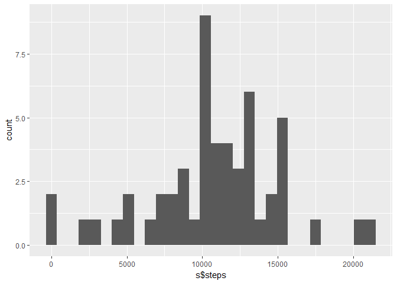
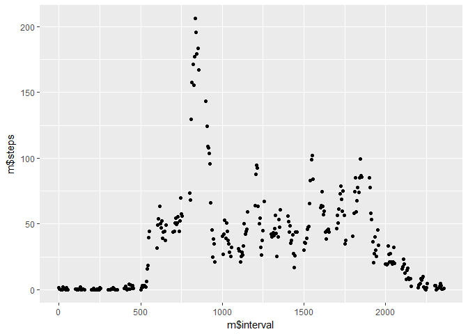

    knitr::opts_chunk$set(echo = TRUE)
    library(ggplot2)
    dat <- read.csv("activity.csv",header=TRUE)

What is the mean total number of steps taken per day?
-----------------------------------------------------

    s <- with(dat,aggregate(steps~date,FUN=sum))
    qplot(s$steps,geom="histogram")

    ## `stat_bin()` using `bins = 30`. Pick better value with `binwidth`.

Calculate the mean number of steps per day. Make a histogram of total
steps per day. Calculate and describe the mean and median number of
steps per day.

What is the average daily activity pattern?
-------------------------------------------

    m <- with(dat,aggregate(steps~interval,FUN=mean))
    qplot(m$interval,m$steps)

Make a time series of the mean number of steps taken in each interval,
averaged across all days. Describe which 5-minute interval contains on
average the maximum number of steps.

Imputing missing values
-----------------------

Calculate the total number of missing values. Explain a strategy for
filling in the missing values. Create a dataset with missing values
filled in.

Are there differences in activity patterns between weekdays and weekends?
-------------------------------------------------------------------------

Create a new factor variable for marking either weekdays or weekends
based on date. Make a panel plot; make time-series plot of average
number of steps taken over each interval for weekdays and weekends.
